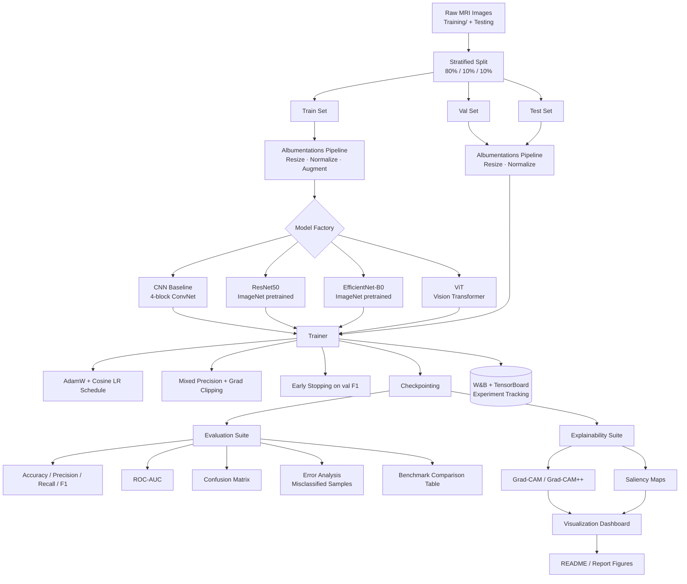

<div align="center">

# 🧠 Brain Tumor MRI Classification with Explainable Deep Learning

**Multi-class brain tumor classification from MRI, benchmarking CNN / ResNet50 / EfficientNet-B0 / ViT backbones and explaining every prediction with Grad-CAM and Saliency Maps.**

[](https://www.python.org/)
[](https://pytorch.org/)
[](LICENSE)

</div>
Designed to run end-to-end in a Kaggle GPU kernel or locally (CUDA / MPS / CPU) using PyTorch and torchvision.

## Key features
- Transfer-learning baselines: ResNet50, EfficientNet‑B0
- From-scratch CNN baseline for benchmarking
- Explainability: Grad‑CAM (pytorch‑grad‑cam) and Captum saliency maps
- Config-driven training loop with checkpointing, early stopping, LR scheduling, and mixed precision (CUDA)
- Simple dataset loader for `masoudnickparvar/brain-tumor-mri-dataset` (Kaggle)

## Stack
- Language: Python 3.8+
- Framework: PyTorch (torch + torchvision)
- Notable libraries: torchvision, pytorch-grad-cam, captum, scikit-learn, pillow, matplotlib, seaborn


## What the notebook does
1. Detects dataset under `data/` (expects `Training/` and `Testing/` with class folders)
2. Builds train/val/test dataloaders and computes class weights
3. Defines models: CNN baseline, ResNet50, EfficientNet‑B0, (optional ViT)
4. Runs configurable training loop with checkpointing and early stopping
5. Evaluates on test set and produces metrics + confusion matrix
6. Produces explainability visualizations using Grad‑CAM and saliency maps

## Dataset (expected layout)
The notebook expects the Kaggle dataset `masoudnickparvar/brain-tumor-mri-dataset` with this layout:

| Class | Description |
|---|---|
| `glioma` | Tumor arising from glial cells |
| `meningioma` | Tumor arising from the meninges |
| `pituitary` | Tumor of the pituitary gland |
| `notumor` | Healthy / no visible tumor |

**Expected directory layout** (see `src/datasets/prepare_dataset.py`):

```
data/raw/
├── Training/
│   ├── glioma/       *.jpg
│   ├── meningioma/   *.jpg
│   ├── notumor/      *.jpg
│   └── pituitary/    *.jpg
└── Testing/
    ├── glioma/
    ├── meningioma/
    ├── notumor/
    └── pituitary/
```

#### Sample Data


## System Architecture



## Metrics & evaluation
#### Plot training curves


#### Confusion Matrix


#### Explainability — Grad-CAM & Saliency Maps


## Key Ideas (Future Work)
### Federated Multimodal Explainable Medical Foundation Model (FME-MFM).
(Multimodal Foundation Models + Explainable AI + Federated Learning for Medical Image Classification)

- Build a privacy-preserving foundation model that learns jointly from medical images, radiology reports, and clinical records across multiple hospitals, while producing clinically interpretable explanations for every diagnosis.
